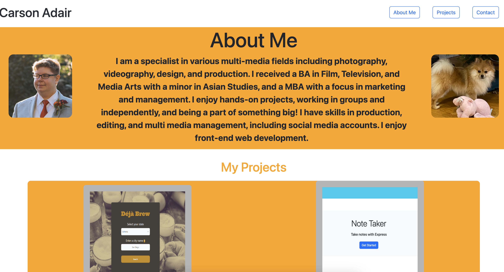
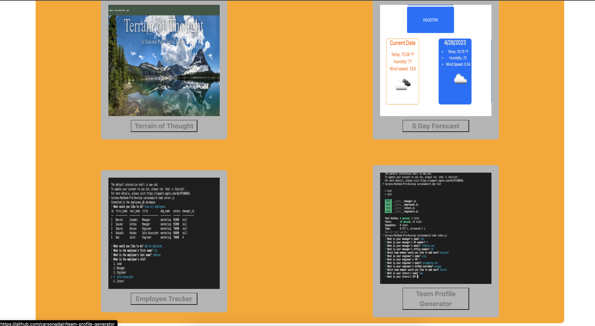
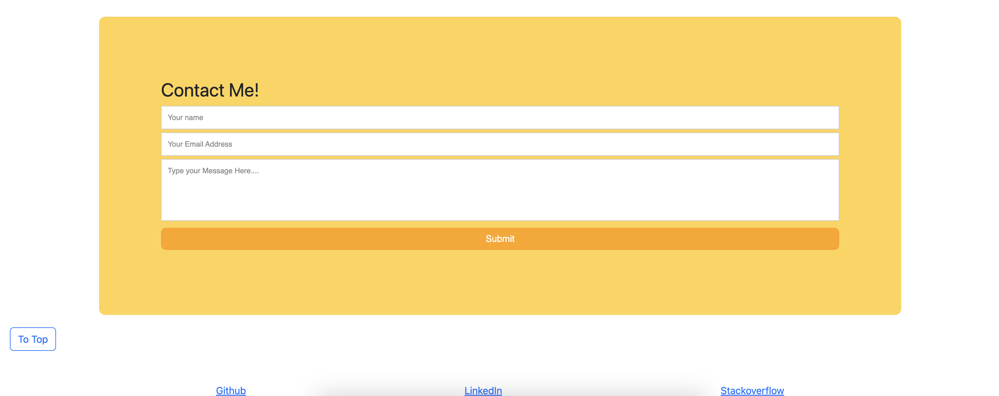

# 20 React: React Portfolio

Welcome to my portfolio created with React. This portfolio features an image of me (as well as my dog!) and a short paragraph about me and my work experience. 

It also features six of my previous projects, including back end and front end apps. 

Finally at the bottom of the page is a contact form where I can be reached, as well as links to my github, linkedin, and stackoverflow pages. 

Here is a screenshot of the deployed app.

This is a link to the deployed application
https://carsonadair.github.io/my-portfolio-react/